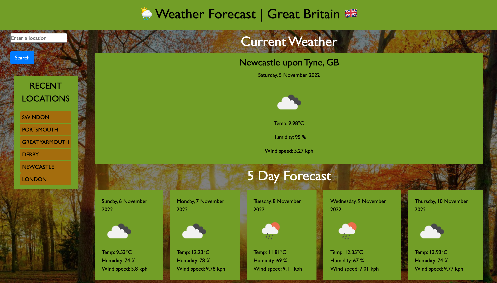

# 06-Server-Side-APIs | Weather Dashboard
Building a weather dashboard that will run in the browser and feature dynamically updated HTML and CSS.

## Website build

Creation of an online weather dashboard, using the Openweather APIs, to fetch data and render data to the dashboard using dynamically updated HTML and CSS.
Build of HMTL, CSS and JavaScript from scratch.

## User Story

* AS A traveler
* I WANT to see the weather outlook for multiple cities
* SO THAT I can plan a trip accordingly

## Acceptance Criteria

* GIVEN a weather dashboard with form inputs
* WHEN I search for a city
* THEN I am presented with current and future conditions for that city and that city is added to the search history
* WHEN I view current weather conditions for that city
* THEN I am presented with the city name, the date, an icon representation of weather conditions, the temperature, the humidity, and the wind speed
* WHEN I view future weather conditions for that city
* THEN I am presented with a 5-day forecast that displays the date, an icon representation of weather conditions, the temperature, the wind speed, and the humidity
* WHEN I click on a city in the search history
* THEN I am again presented with current and future conditions for that city

The main challenge i faced, was getting used to using the fetch command and interpreting the returned data from the API. I overcame this by researching other websites using APIs, reading forums, looking through tutorials and practising before implementation of my own weather dashboard. In the end i really enjoyed using APIs and seeing the data that can be returned for use on your own website and the multiple applications that they have.

I also had the opportunity to practise and refine my current HTML and CSS skills.

I hope to optimize the weather dashboard further in the future, when i have more knowledge on server side APIs, JavaScript, HTML and CSS.

## Using the code
I have fully commented the JavaScript files, to explain the flow and logic of the weather dashboard, so that others can work on this and expand on it too.
I have also tried to use correct semantic structure within the HTML and CSS files, so the code can be easily followed and worked on.

# The Weather Dashboard

## Link to deployed application.

<a href="https://enigmawoman.github.io/06-Server-Side-APIs/">Deployed Online Weather Dashboard</a>

## Screenshot of the finished website 

## License

NA
